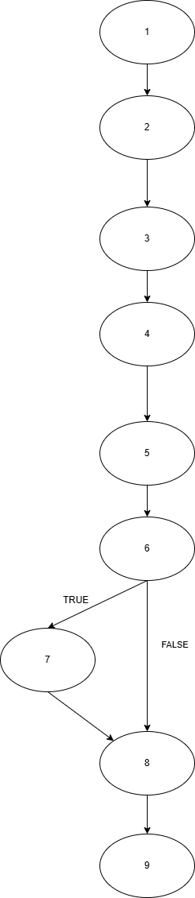
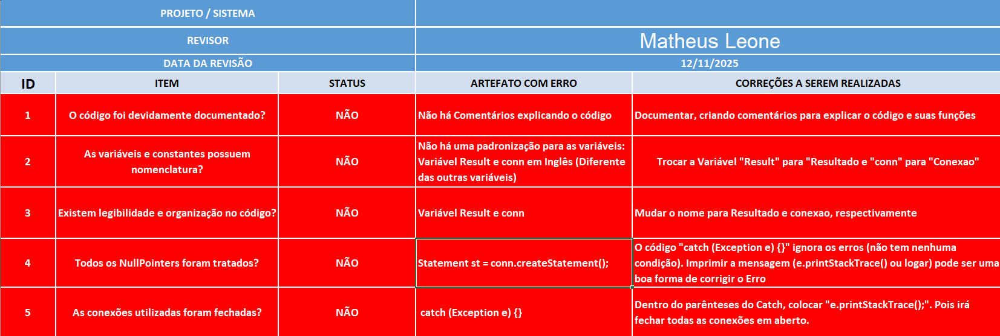

# TESTE_CAIXA_BRANCA

## 📌 1. Complexidade Ciclomática

A **Complexidade Ciclomática (CC)** é uma métrica usada para mensurar a complexidade lógica de um algoritmo ou fluxo, indicando a quantidade mínima de testes necessários para garantir cobertura total das decisões.

### **Fórmula utilizada**
M = E - N + 2

Onde:  
- **E** = número de Arestas  
- **N** = número de Nós  
  
  M = 9 - 9 + 2 * 1

  M = 9 - 9 + 2

  M = 9 - 11
  
  M = 2

Esse valor indica que o código possui 2 caminhos independentes.

---

## 📌 2. Caminhos Básicos

Com base na Complexidade Ciclomática, foram identificados os 2 independentes.

**CAMINHO BÁSICO 1**

1 → 2 → 3 → 4 → 5 → 6 → 7 → 8

  O usuário existe no banco

  O IF é verdadeiro

  Variáveis result e nome são atualizadas

**CAMINHO BÁSICO 2**

1 → 2 → 3 → 4 → 5 → 6 → 8

Nenhum usuário encontrado

  O IF é falso

  Não entra no bloco TRUE

---

## 📌 3. Fluxo de Grafo (PNG)

O Grafo de fluxo utilizado para a representar o código.

📎 **`fluxo_grafo.png`**

---

## 📌 4. Planilha de Teste

Foi utilizada uma planilha no Excel para responder perguntas relevantes para a análise do código

📎 **`planilha_analise.png`**

## ✨ Autor

Realizado por Matheus Leone Rosa Evangelista
RA #248206

